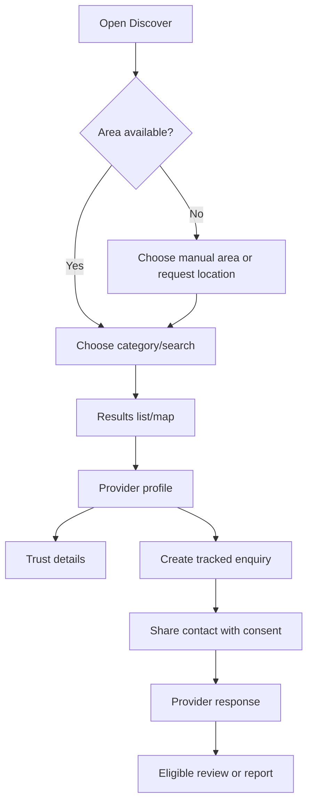
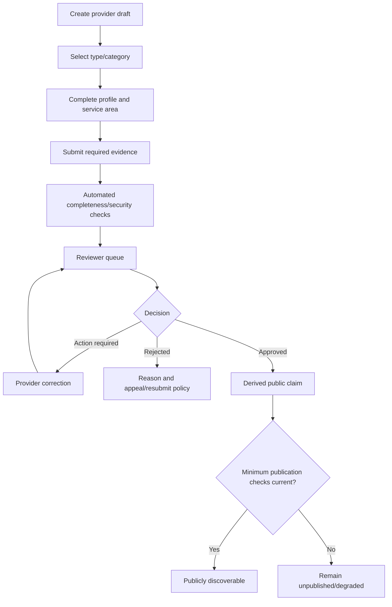
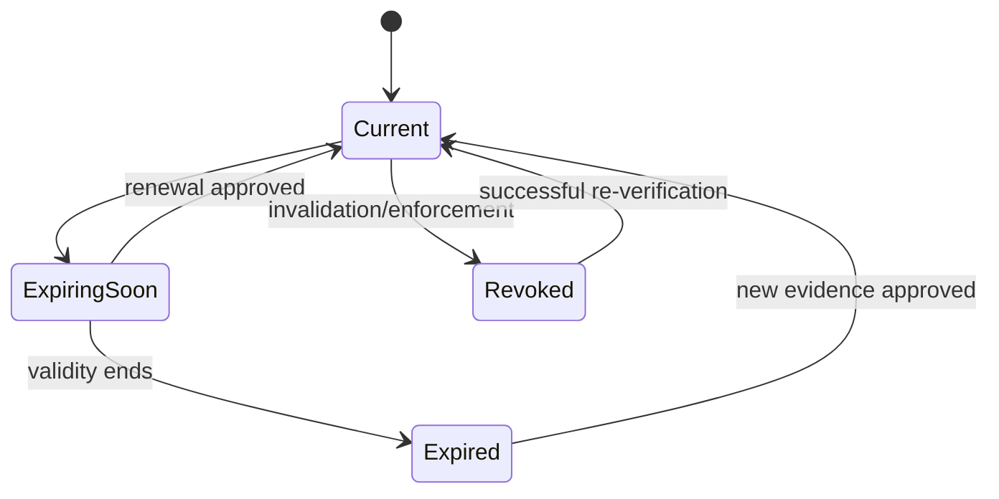
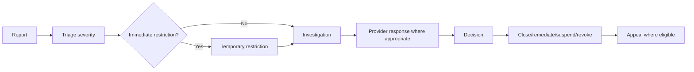

# DIREKT User Flow Diagrams

## Customer discovery

```mermaid
flowchart TD
  A[Open Discover] --> B{Area available?}
  B -- No --> C[Choose manual area or request location]
  B -- Yes --> D[Choose category/search]
  C --> D
  D --> E[Results list/map]
  E --> F[Provider profile]
  F --> G[Trust details]
  F --> H[Create tracked enquiry]
  H --> I[Share contact with consent]
  I --> J[Provider response]
  J --> K[Eligible review or report]
```

## Provider verification

```mermaid
flowchart TD
  A[Create provider draft] --> B[Select type/category]
  B --> C[Complete profile and service area]
  C --> D[Submit required evidence]
  D --> E[Automated completeness/security checks]
  E --> F[Reviewer queue]
  F --> G{Decision}
  G -- Action required --> H[Provider correction]
  H --> F
  G -- Rejected --> I[Reason and appeal/resubmit policy]
  G -- Approved --> J[Derived public claim]
  J --> K{Minimum publication checks current?}
  K -- Yes --> L[Publicly discoverable]
  K -- No --> M[Remain unpublished/degraded]
```

## Expiry

```mermaid
stateDiagram-v2
  [*] --> Current
  Current --> ExpiringSoon
  ExpiringSoon --> Current: renewal approved
  ExpiringSoon --> Expired: validity ends
  Expired --> Current: new evidence approved
  Current --> Revoked: invalidation/enforcement
  Revoked --> Current: successful re-verification
```

## Complaint and enforcement

```mermaid
flowchart LR
  A[Report] --> B[Triage severity]
  B --> C{Immediate restriction?}
  C -- Yes --> D[Temporary restriction]
  C -- No --> E[Investigation]
  D --> E
  E --> F[Provider response where appropriate]
  F --> G[Decision]
  G --> H[Close/remediate/suspend/revoke]
  H --> I[Appeal where eligible]
```

Diagrams are conceptual. Backend state machines are authoritative.
